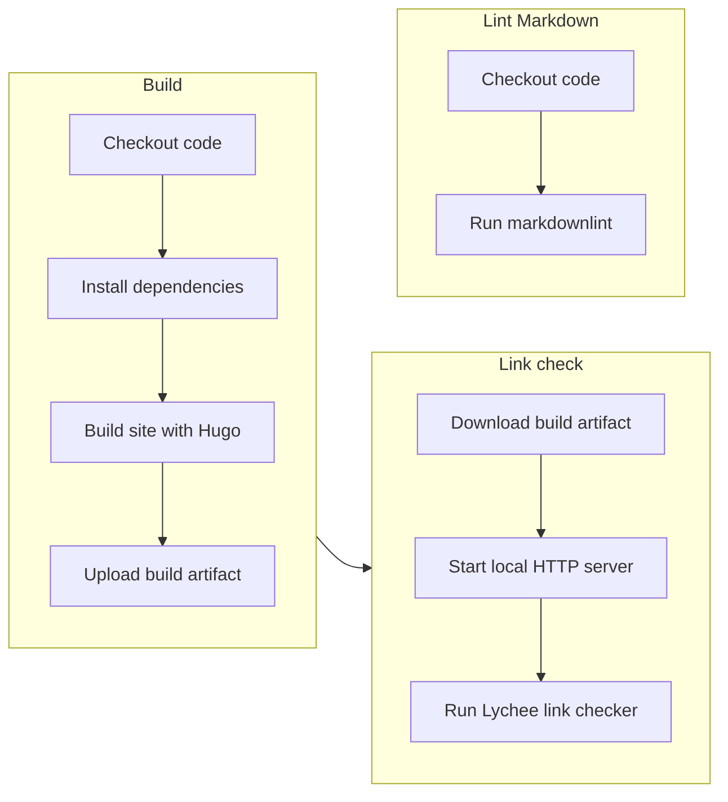
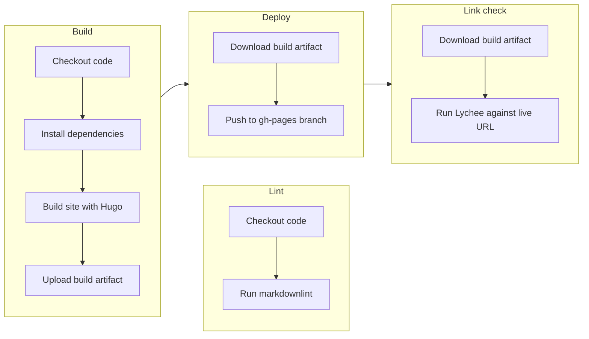

I have experience managing software deployments and maintaining build processes. In a previous role, I handled deployments to production servers and coordinated releases across environments.

After leaving that position, I wanted hands-on experience with modern CI/CD tooling — specifically GitHub Actions and automated content quality checks. This site's pipeline is the result: automated builds, content validation, and deployment to GitHub Pages, with quality checks that run on every pull request and after every deployment.

---

## What I built

Two GitHub Actions workflows that handle the full lifecycle from pull request to production:

**CI workflow** — Runs on every pull request. Builds the site, lints all Markdown content, and validates links by spinning up a local server and checking against it.

**Deploy workflow** — Runs on push to `main`. Builds and deploys the site, then validates links against the live production URL to confirm the deployment succeeded.

---

## Quality checks

### Markdown linting

All content is checked against a customized [markdownlint](https://github.com/DavidAnson/markdownlint) configuration. Catches formatting inconsistencies and potential rendering issues before they reach production.

### Link checking

Broken links are caught automatically using [Lychee](https://github.com/lycheeverse/lychee). The approach differs between CI and deploy:

- **CI** — Spins up a local HTTP server and checks links against the built site. Fast feedback without depending on external services.
- **Deploy** — After publishing, checks links against the live production URL. Confirms the deployment worked and catches issues that only appear in production.

---

## Configuration

| File | Purpose |
|------|---------|
| [ci.yml](https://github.com/nandstand/sample-site/blob/main/.github/workflows/ci.yml) | CI workflow |
| [deploy.yml](https://github.com/nandstand/sample-site/blob/main/.github/workflows/deploy.yml) | Deploy workflow |
| [.markdownlint.yaml](https://github.com/nandstand/sample-site/blob/main/.markdownlint.yaml) | Linting rules |
