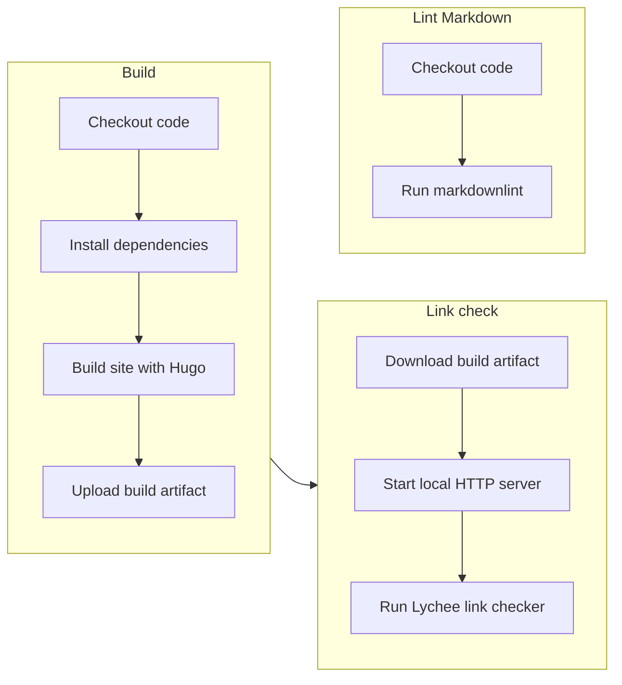
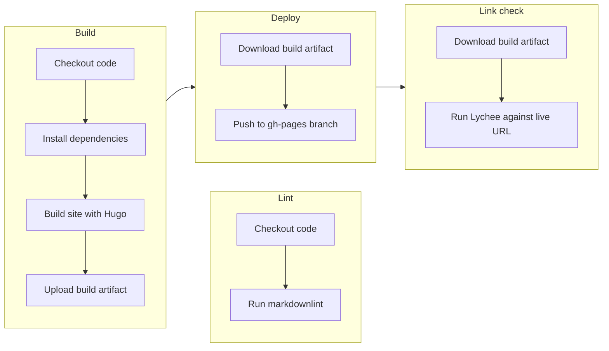

In my previous role, one of my responsibilities was managing the deployment of updates to my primary software project.
I managed the deployment of code changes that I wrote myself, and coordinated with teammates to get their changes merged in.

After leaving that role, I was interested in learning modern tools and techniques for handling this process.
I taught myself GitHub Actions and developed a CI/CD pipeline that tests and deploys the site as changes are made.
I also used this as an opportunity to get more hands-on experience with GitHub's pull request workflow by implementing CI tests for every merge into main.

---

## What I built

Two GitHub Actions workflows that handle building, testing, and deploying the live site.

**CI workflow** — Runs on every pull request. Builds the site, lints all Markdown content, and validates links by spinning up a local server and checking against it.

Full workflow file: [ci.yml](https://github.com/nandstand/sample-site/blob/main/.github/workflows/ci.yml)

**Deploy workflow** — Runs on push to `main`. Builds and deploys the site, then validates links against the live production URL to confirm the deployment succeeded.

Full workflow file: [deploy.yml](https://github.com/nandstand/sample-site/blob/main/.github/workflows/deploy.yml)

---

## Quality checks

### Markdown linting

All content is checked against a customized [markdownlint](https://github.com/DavidAnson/markdownlint) configuration. Catches formatting inconsistencies and potential rendering issues before they reach production.

### Link checking

Broken links are caught automatically using [Lychee](https://github.com/lycheeverse/lychee). The approach differs between CI and deploy:

- **CI** — Spins up a local HTTP server and checks links against the built site.
- **Deploy** — After publishing, checks links against the live production URL.
